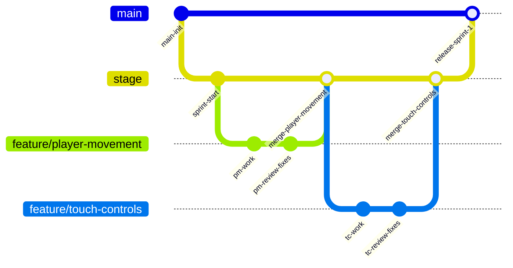

# Source Control

## Purpose

This document defines the source control workflow for the team. The goal is to keep work organized, make collaboration smoother, and reduce integration issues during a sprint.

The team will use GitHub as the primary source control platform.

---

## Repository Model

The project will use the following branch structure:

- `main`
- `stage`
- feature branches created from `stage`

### Branch Flow

### Branch Roles

#### `main`
- contains release-ready code
- should represent the current stable version of the project
- should only receive changes that are ready to release

#### `stage`
- integration branch for active sprint work
- feature work is squash merged into `stage`
- serves as the main testing and validation branch before release
- should reflect the current candidate build for the sprint

#### Feature Branches
- created from `stage`
- used for individual features, fixes, or focused work
- squash merged back into `stage` after review

---

## Branching Workflow

### Creating Work
1. pull the latest `stage`
2. create a feature branch from `stage`
3. complete the work on the feature branch
4. open a pull request into `stage`

### Integration
- completed features live in `stage`
- `stage` is the working integration branch for the sprint
- once the sprint release is ready, `stage` is squash merged into `main`

### Release Flow
1. confirm items in `stage` are ready for release
2. review integrated behavior in `stage`
3. merge `stage` into `main`
4. tag or document the release if needed

---

## Branch Naming

Feature branches should use clear, descriptive names.

### Examples
- `feature/player-movement`
- `feature/touch-controls`
- `feature/wave-spawning`
- `bugfix/collision-check`
- `chore/docker-update`

### Guidelines
- use lowercase
- separate words with hyphens
- keep names short but descriptive
- one branch should focus on one feature or one logical fix

---

## Commit Standards

Commits should be:

- small enough to understand
- focused on a single logical change
- clearly named

### Good commit message examples
- `Add player movement boundaries`
- `Set up Docker local web server`
- `Refactor input handling into module`
- `Fix collision detection for lane edges`

### Avoid
- `update`
- `changes`
- `stuff`
- `fix things`

---

## Pull Request Process

All feature work should go through pull requests.

### Feature Branch to Stage
A pull request into `stage` should include:

- what changed
- why it changed
- how it was tested
- any known limitations or follow-up items

### Expectations
- the change should meet the feature goal
- automated testing should pass if available
- the feature branch should receive two peer reviews before merge
- the feature should be tested in an actual environment before being considered complete

---

## Review Expectations

Before merging a feature branch into `stage`:

- the code should pass linting and formatting checks
- automated testing should pass where available
- the feature should be reviewed by two peers
- the feature should be tested in a real environment
- review feedback should be addressed

Before merging `stage` into `main`:

- the integrated work in `stage` should be peer reviewed
- critical defects should be resolved
- the current sprint release should be considered stable enough for release

---

## Merge Rules

### Into `stage`
A feature branch may be squash merged into `stage` when:
- it does what it was intended to do
- automated checks pass
- it has two peer reviews
- it has been tested in an actual environment

### Into `main`
`stage` may be squash merged into `main` when:
- the sprint release is ready
- work in `stage` has been reviewed
- major issues have been resolved
- the team agrees the release is stable enough to ship

---

## Protected Branch Expectations

If GitHub settings allow, the team should protect:

### `main`
- no direct pushes
- pull request required
- review required before merge

### `stage`
- no direct pushes unless explicitly agreed for emergency cases
- pull request required for normal feature integration

---

## GitHub Usage Expectations

The team will use GitHub as much as possible for workflow visibility.

This includes:
- repository hosting
- pull requests
- code review
- issues
- project boards
- release visibility where helpful

---

## Working Agreement Summary

- `main` is stable and release-ready
- `stage` is the integration branch for sprint work
- feature branches come from `stage`
- feature branches merge back into `stage`
- completed sprint-ready work in `stage` is squash merged into `main`
- all major changes go through pull request review
- features require two peer reviews before moving into `stage`
- `stage` should be reviewed before release into `main`
